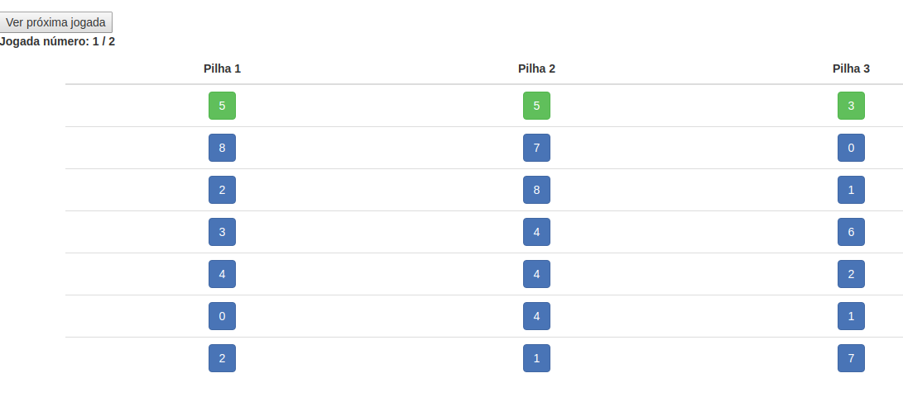

# Java para AWS lambda

A arquitetura serverless permite a construção progressiva de sistemas informáticos de grande porte. Método que pode ser aproveitado junto com as capacidades proprias da linguagem JAVA (https://aws.amazon.com/es/blogs/opensource/java-apis-aws-lambda/ )

Podemos iniciar o aprendizado de este serviço da nuvem AWS usando o exemplo já mencionado nas palestras de Java:

## Exemplo de Jogo de Cartas:


Primeiramente vamos ver o enunciado deste jogo:

Pedro decidiu abandonar o bar da faculdade onde jogava truco para dedicar-se ao mundo da programação. Para que isso fosse mais fácil, decidiu criar um novo jogo de cartas: **O coração das cartas**
Dito jogo carateriza-se por:

+ Ser jogado por uma única pessoa. 
+ É jogado com três pilhas, inicialmente com o mesmo número de cartas.
+ Cada carta tem um valor numérico inteiro de 0 até 9. 
+ O jogador pode, a qualquer momento ver o valor de qualquer carta, mas só pode jogar com as cartas que estão no topo das pilhas. 
+ Em cada rodada, o jogador pode remover qualquer combinação de cartas que estejam no topo da pilha (pode escolher 1, 2 ou até 3 cartas) cuja soma dos valores seja múltiplo de 3. 
+ O jogo é ganho quando todas as cartas forem removidas das pilhas. 
+ Se alguma carta não puder ser removida, perde-se o jogo.

**Construindo uma API:** 

Com ajuda do código java **[Hello.java](./outubro24/src/main/java/example/Hello.java)** que  implementa o algoritmo deste jogo, pode-se construir uma API disponibilizada no endpoint:

https://45of55mka4.execute-api.us-west-2.amazonaws.com/default/jogo-cartas-coracao-java8

Cuja saída, no formato JSON:

```json
{"altura_cartas":"7", "numero_jogadas":1,"resultado":"PERDEU", "jogadas": [{
  "0": [
    "1",
    "7",
    "6"
  ],
  "1": [
    "2",
    "2",
    "3"
  ],
  "2": [
    "1",
    "3",
    "7"
  ],
  "3": [
    "1",
    "1",
    "4"
  ],
  "4": [
    "6",
    "4",
    "3"
  ],
  "5": [
    "8",
    "8",
    "8"
  ],
  "6": [
    "0",
    "4",
    "4"
  ]
}]}
```
Carateriza-se por:
+ Indicar a altura inicial das colunas de cartas: com ajuda do campo **altura_cartas**.
+ Indicar o número de jogadas possíveis antes de declarar o jogo finalizado: o campo **numero_jogadas**
+ Indicar o resultado final: no campo **resultado**

Esta API esta sendo aproveitada por um **Front-End** codificado no arquivo **[index.html](./index.html)** cuja interface visual pode se apreciar da forma:





## Dica de produtividade 

Uma sequencia de passos para acelerar a compilação local do código Java e a instalação de dito código (arquivo JAR) como **AWS lambda** pode ser:

+ mvn package -f "/home/julian/github/jogos/cartas/outubro24/pom.xml";
+ Executar o comando na **CLI AWS**:
```bash
aws lambda update-function-code --function-name my-function --zip-file fileb://y-function.zip
```
Sequencia está que foi embutida no script: [shell.sh](./outubro24/shell.sh)


