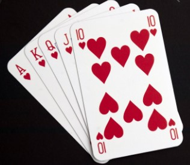

# Micro curso Java

O primeiro que devemos lembrar é a significativa extensão do **mundo Java**, portanto aprender Java significa dedicar muitas horas para o estudo e treino de cada **ecosistema Java**.

Nesta oportunidade vou apresentar uma sequência simples de códigos em Java com o intuito de lhes ajudar na familiarização com dita linguagem de programação e com vários algoritmos básicos que podem ser aproveitados num prazo de três (03) meses.

## Exemplo de Jogo de Cartas:

Primeiramente vamos ver o enunciado deste jogo:

Pedro decidiu abandonar o bar da faculdade onde jogava truco para dedicar-se ao mundo da programação. Para que isso fosse mais fácil, decidiu criar um novo jogo de cartas: **O coração das cartas**
Dito jogo carateriza-se por:

+ Ser jogado por uma única pessoa. 
+ É jogado com três pilhas, inicialmente com o mesmo número de cartas.
+ Cada carta tem um valor numérico inteiro de 0 até 9. 
+ O jogador pode, a qualquer momento ver o valor de qualquer carta, mas só pode jogar com as cartas que estão no topo das pilhas. 
+ Em cada rodada, o jogador pode remover qualquer combinação de cartas que estejam no topo da pilha (pode escolher 1, 2 ou até 3 cartas) cuja soma dos valores seja múltiplo de 3. 
+ O jogo é ganho quando todas as cartas forem removidas das pilhas. 
+ Se alguma carta não puder ser removida, perde-se o jogo.

**Entrada:** A entrada é composta por várias instâncias Cada instância é iniciada por um inteiro N (0 ≤ N ≤ 100), que identifica o número de cartas em cada pilha. A entrada termina quando N = 0. Cada uma das N linhas seguintes contém três inteiros A, B e C, que descrevem os valores numéricos das cartas em um nível da pilha (0 ≤ A, B, C ≤  9). As pilhas são descritas do topo até o fundo.

**Saída:** Para cada instância, imprima uma linha contendo o número 1 se o jogador pode ganhar a instância do jogo ou o número 0 se o jogo for impossível.

### Resolução:

Pode-se ver que o código **[CoracaoCartas.java](./CoracaoCartas.java)** implementa uma forma simples do algorimo deste jogo.

